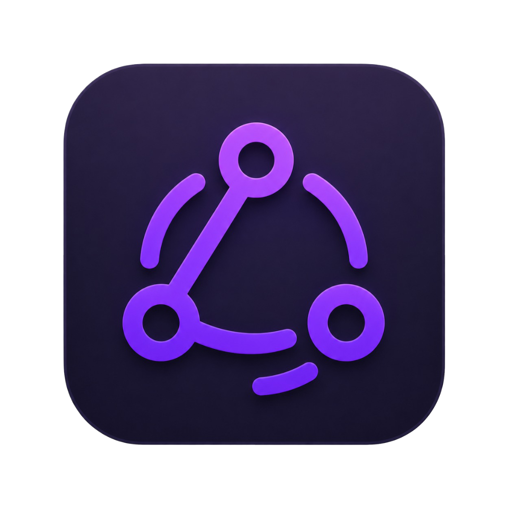
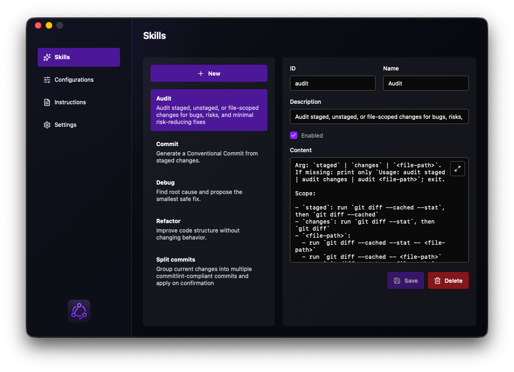

<p align="center">
  
</p>

<h1 align="center">AISync</h1>

<p align="center">
  A small desktop app for keeping AI coding-agent skills and instructions in sync.
</p>

<p align="center">
  <strong>Local-first</strong> · <strong>Optional GitHub sync</strong> · <strong>macOS</strong> · <strong>Tauri</strong> · <strong>React</strong>
</p>

<p align="center">
  
</p>

## Overview

AISync gives you one place to edit the prompts, skills, and instruction files you use across AI coding tools.

It keeps the source of truth in a local AISync folder, then syncs enabled skills and global instructions into configured tool folders with symbolic links. The default targets are Codex, Copilot, and Pi, and custom targets can be added from the app.

AISync is local-first by default. You can also connect GitHub to back up and sync your AISync instructions and skills through a private repository.

## Features

- Manage reusable AI-agent skills.
- Edit shared global instructions.
- Sync into multiple tool configurations.
- Optionally sync instructions and skills through GitHub.
- Resolve local/remote sync conflicts.
- Enable or disable individual skills and targets.
- Backup existing target files before replacing them.
- Light, dark, and system themes.
- English and Swedish UI.

## How it works

AISync stores its data under `~/.aisync` by default:

- `config.json` stores sync targets and skill metadata.
- `skills/` stores skill folders.
- `instructions.md` stores global instructions.

When you save changes, AISync updates enabled targets by creating symlinks from the target tool folders back to the AISync source files. Existing target files are backed up into `.aisync-backups` before they are replaced.

If GitHub sync is enabled, AISync uses GitHub device login, stores the token in the system keychain, and syncs AISync-owned instructions and skills under `.aisync/` in a private `aisync-config` repository. macOS may ask for permission to store or access the token in Keychain.

For development and tests, the local root can be overridden with `AISYNC_HOME`.

## Requirements

- macOS
- Node.js
- pnpm
- Rust
- Tauri prerequisites

Linux and Windows adapters exist in the codebase, but they are not implemented yet.

## Download and install on macOS

1. Open the latest GitHub Release: <https://github.com/mohammedhammoud/ai-sync/releases/latest>
2. Download the `.dmg` file from the release assets.
3. Open the DMG.
4. Drag `AISync.app` into `Applications`.
5. Launch AISync from `Applications`.

Only download AISync from the official GitHub Releases page above.

AISync is currently unsigned and not notarized. On first launch, macOS Gatekeeper may show:

```txt
"AISync" cannot be opened because Apple cannot check it for malicious software.
```

Safe workaround:

1. Move `AISync.app` to `Applications`.
2. Right-click `AISync.app`.
3. Choose `Open`.
4. Confirm `Open` in the dialog.

If macOS still blocks the app:

1. Open `System Settings`.
2. Go to `Privacy & Security`.
3. Scroll to `Security`.
4. Click `Open Anyway` for AISync.
5. Confirm `Open`.

If that still does not work, remove the quarantine flag manually. Only do this for an app downloaded from the official release page:

```sh
xattr -dr com.apple.quarantine /Applications/AISync.app
```

The app checks the latest GitHub Release on startup and shows an in-app notification when a newer stable version is available.

## Development

Install dependencies:

```sh
pnpm install
```

Run the web app:

```sh
pnpm dev
```

Run the desktop app:

```sh
pnpm tauri dev
```

Build:

```sh
pnpm build
pnpm tauri build
```

## Release

The `Release` workflow runs Release Please from Conventional Commits on `main`. It opens a release PR; merging that PR updates versions and changelog, creates the `v*.*.*` tag, then builds an unsigned universal macOS DMG.

The same workflow can also be run manually with an existing tag to rebuild/upload the DMG.

No Apple Developer Program is required for this workflow. macOS Gatekeeper may warn users on first open because the app is not signed or notarized.

The release build uploads the DMG to the GitHub Release.

## Quality checks

```sh
pnpm typecheck
pnpm lint
pnpm test:unit
pnpm test:e2e
```

Storybook:

```sh
pnpm storybook
```

## Tech stack

- Tauri 2
- React 19
- TypeScript
- Vite
- Tailwind CSS
- Zustand
- TanStack Router
- i18next
- Vitest
- Playwright
- Storybook

## Contributing

Issues and pull requests are welcome.

Keep changes small, focused, and easy to review. Prefer simple behavior, local-first defaults, and clear file-system safety.

## License

MIT. See [LICENSE](./LICENSE).
